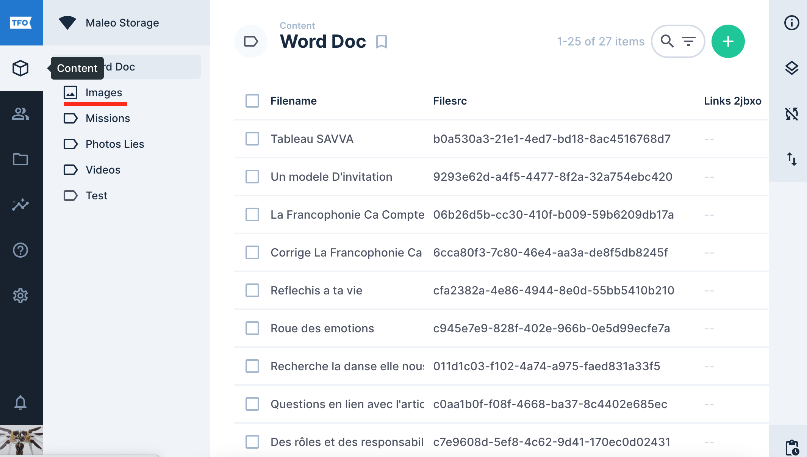
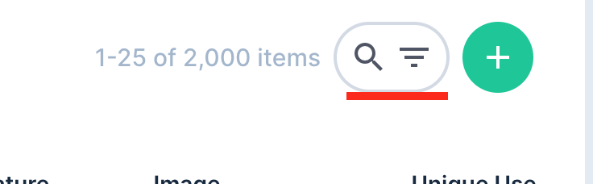
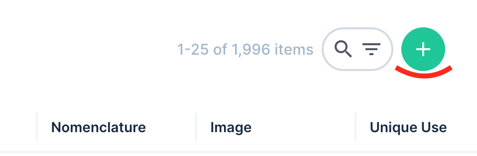
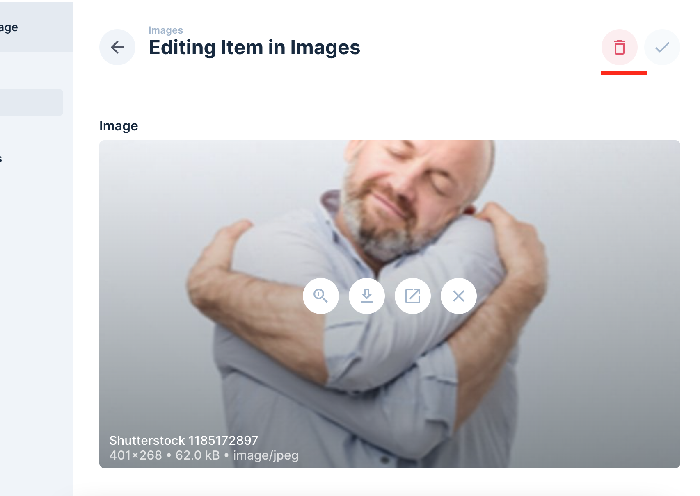
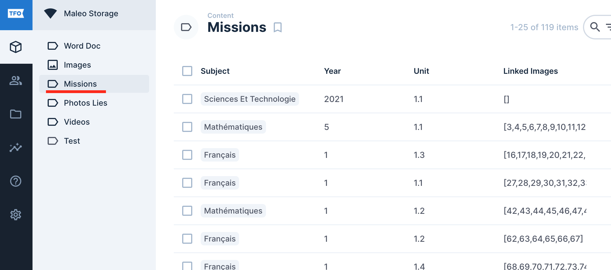
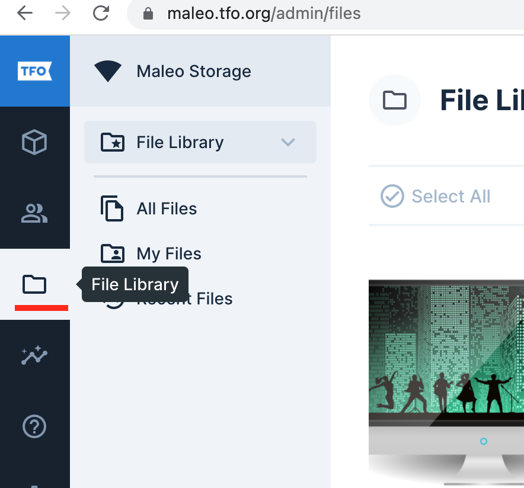
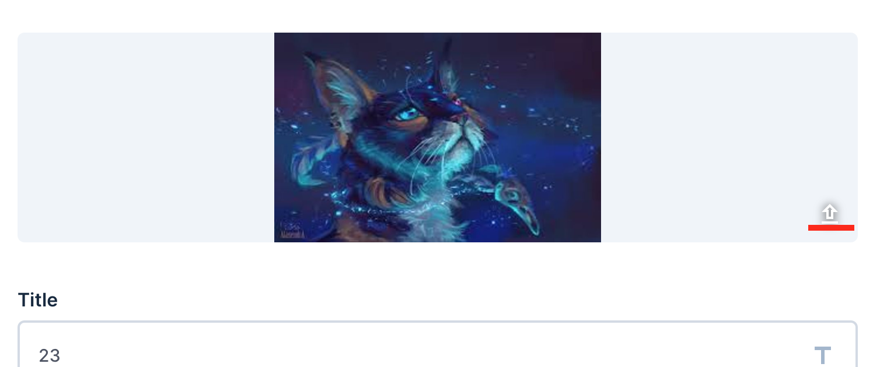

# Guide d'Utilisation du CMS Pralo
---

Le CMS de Maleo permet de répertorier toutes les images qui sont utilisées pour les projets suivants:

- Maleo
- Formation Professionnelle
- Celso

Le site est accessible a travers le lien [maleo.tfo.org](https://maleo.tfo.org)

## Fiche Image
---

!!! 
Seul les utilisateurs avec certains accès peuvent modifier une fiche image. Si vous n'y avez pas accès et voulez faire des changements, veuillez contacter l'equipe Solutions Numériques via le portail [Assistance](https://assistance.tfo.org) 
!!!

Rendez vous dans le menu "Content" et dans les options qui s'offrent a vous, choisissez "Images".

::: 
 
:::

Vous aurez accès a toutes les fiches d'images présentes sur le site. Vous pouvez effacer, modifier ou ajouter des fiches d'images en fonction de vos permissions. Vous pouvez chercher une fiche spécifique en entrant des informations sur la fiches dans la champs se trouvant au dessus a droit sur la page.

:::img 
 
:::

### Créer une fiche image

Lorsque vous êtes dans la page contenant la liste de fiches d'images, cliquez sur le bouton "+" se trouvant au sommet a droite sur la page.

 

Cela vous permettra de remplir le formulaire de creation de la fiche. Une fois la fiche remplie, vous pouvez sauvegarder le tout.

!!! 
Il se peut que vous ayez des problème de téléversement d'image lors de la creation de la page. Dans un cas pareil, veuillez essayer les élements suivants:

- Assurez vous que la taille de l'image ne dépasse pas 5Mb
- Il y a parfois des problème qui surgisse lors de la sauvegarde de l'image. Veuillez essayer de retravailler l'image a l'aide d'un optimisateur d'image. Ex: [Image Optimizer](http://www.imageoptimizer.net/Pages/Home.aspx)

Si le problème persiste après malgré cela, veuillez faire un ticket sur le portail [Assistance](https://assistance.tfo.org) 
!!!

### Effacer une fiche image

Pour effacer une fiche, vous devez d'abord selectionner la fiche que vous voulez traiter. Dans la page de detail de l'affiche, au dessus a droite sur la page, vous verrez le bouton pour effacer la fiche. 

 

### Modifier une fiche image

Modifiez les champs de la fiche puis cliquez sur "Enregistrer". !!!warning Les changements d'image ne doivent pas être fait dans la fiche image. Car cela ne fera que modifier l'image qui est affiche dans la fiche. Ca ne change pas l'image elle meme. Pour modifier l'image, vous devez a la Modification de l'image !!!

## Fiche Mission
---

La fiche mission est utiliéee pour entrer toutes les informations indiquant aux utilisateurs dans quel projet les images sont utilisées.

On peut y acceder en allant dans le menu "Content" et en choissisant "Missions" dans le sous-menu.

 

Les elements de la fiche mission sont modifiable de la meme maniere que la fiche image.

## Modification de l'image
---

Voici les étapes a suivre si vous voulez remplacer une image qui a deja été mise enligne.

Dans le menu sur la gauche de la page, allez dans "Librairie des Fichiers".

 

Vous aurez la liste de toutes les images du CMS. Vous pouvez chercher l'image que vous voulez modifier. Ouvrez l'image, puis clique sur l'icon présent en dessous a droite de l'image lorsque vous positionnez la souris au dessus de l'image.

 

En cliquant sur cette icone, vous pourrez uploader une nouvelle image. Veuillez noter qu'il n'y aura pas de message de confirmation. Une fois que l'image est uploade, ca remplacera l'image existante.

!!!warning
- Vous devez vous assurer que la nouvelle image a le meme format que l'image que vous voulez remplacer. Ex: Si l'image était au format **png**, la nouvelle image doit aussi etre au format **png**.
- Une fois un élement modifié, il ne vous est pas possible de retourner a la fiche tel qu'elle était avant la modification. Faites donc attention avant de sauvegarder. 
!!!
